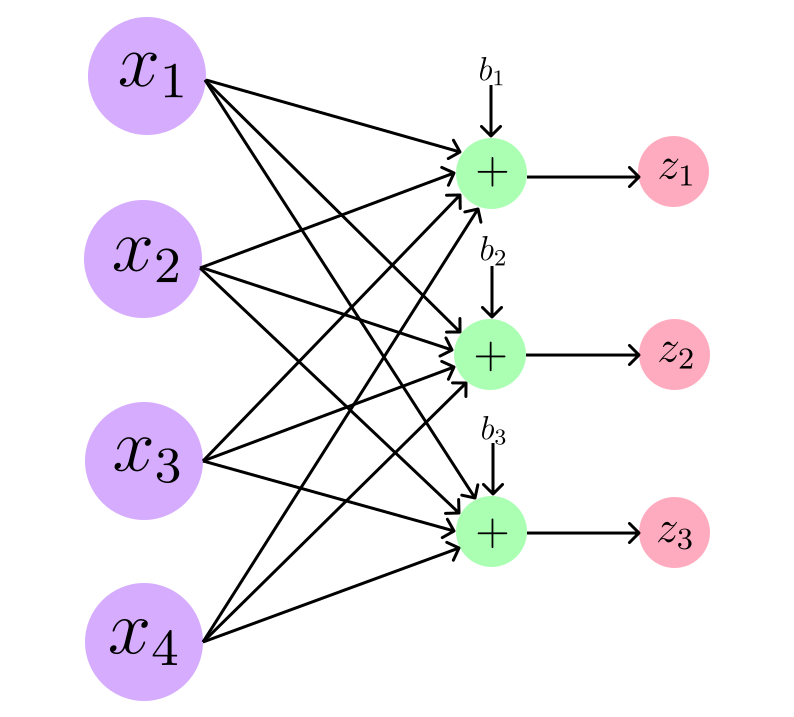

# Model Uncertainty

The following experiment highlights the fundamental concept of model uncertainty in neural networks, where different parameter initializations can lead to equally valid solutions in the weight space, all capable of correctly classifying unseen data.
Understanding this variability is crucial for developing robust AI systems, as it reminds us that there is rarely a single 'correct' neural network for a given problem, but rather a family of solutions with similar performance characteristics.
To illustrate this, we use the Iris dataset, which contains 150 data points representing three different flower species. Each sample includes four numerical features: sepal length, sepal width, petal length, and petal width, as shown in the picture.

<figure style="text-align: center;">
  
  <figcaption>The three Iris species. Measurements are shown only for Iris Versicolor.</figcaption>
</figure>

We exclude one sample from the dataset, which is:

$$
\mathbf{x} = [6.4, 3.2, 4.5, 1.5]^T.
$$

This sample is belong to versicolor flowers, i.e., 

$$
\text{The original sample class} = \text{2 (versicolor)}.
$$

Thus, we have 149 samples in total. If we split the data into 80% training and 20% testing (inference), we get approximately (120, 30).
We consider a one-layer neural network architecture, as shown below. This network has four inputs and three outputs. Therefore, we train a single-layer network using 120 data points.

<figure style="text-align: center;">
  
  <figcaption>A single-layer neural network with 4 inputs and 3 outputs.</figcaption>
</figure>

We test the network on the sample we held out earlier to demonstrate that different initializations lead to different trained networks. How do we know the trained networks are different? They each have a matrix of weights and a vector of biases, and as you can see, all of them differ across runs.

Here is the core code:

```python
iris_data = load_iris()
iris_data, sample = drop_given_sample(iris_data, sample)

iris_data = split_iris(iris_data, data_seed, test_size)
iris_data, train_mean, train_std = normalize_iris(iris_data)

model = OneLayerNNModel(feature_size, class_size).double()
initialize_model(model, param_value_seed)
# define optimizer
optimizer = optim.SGD(model.parameters(), lr=lr)
# define criterion (cross entropy loss)
criterion = nn.CrossEntropyLoss()
train_iris_using_gradient_descent(model, optimizer, criterion, 
iris_data, steps, verbose=False)
test_iris(model, criterion, iris_data, verbose=False)
```

The results are as follows:


**Run 1: Data Seed (102) and Initialization Seed (435)**

$$
\text{Mean vector: } \boldsymbol{\mu} = [5.84, 3.03, 3.8, 1.22]^T
$$

$$
\text{Standard deviation vector: } \boldsymbol{\sigma} = [0.8, 0.42, 1.72, 0.76]^T
$$

$$
\text{Normalized vector: } \mathbf{x_{norm}} = [0.7, 0.42, 0.41, 0.37]^T
$$

$$
\mathbf{z} = \mathbf{W}\mathbf{x_{norm}} + \mathbf{b}
$$

$$
\mathbf{z} =
\begin{bmatrix} 
-1.32 & 0.78 & -1.91 & -1.37 \\ 
0.23 & -0.88 & 0.11 & -0.38 \\ 
0.3 & -0.88 & 1.36 & 2.9 \\
\end{bmatrix} 
\begin{bmatrix} 0.7 \\ 0.42 \\ 0.41 \\ 0.37 \end{bmatrix} + \begin{bmatrix} -0.66 \\ 2.03 \\ -0.66 \end{bmatrix}
$$

$$
\mathbf{z} =
\begin{bmatrix} -2.53 & \\ 1.73 & \leftarrow \max \\ 0.8 & \end{bmatrix}
$$

The predicted label is 2 which is matched with versicolor!


**Run 2: Data Seed (860) and Initialization Seed (270)**

$$
\text{Mean vector: } \boldsymbol{\mu} = [5.8, 3.1, 3.59, 1.14]^T
$$

$$
\text{Standard deviation vector: } \boldsymbol{\sigma} = [0.85, 0.42, 1.84, 0.79]^T
$$

$$
\text{Normalized vector: } \mathbf{x_{norm}} = [0.71, 0.24, 0.5, 0.45]^T
$$

$$
\mathbf{z} = \mathbf{W}\mathbf{x_{norm}} + \mathbf{b}
$$

$$
\mathbf{z} =
\begin{bmatrix} 
-1.66 & 1.17 & -1.87 & -1.81 \\ 
0.09 & -0.44 & 0.1 & -0.94 \\ 
-0.03 & -0.08 & 1.51 & 2.09 \\
\end{bmatrix} 
\begin{bmatrix} 0.71 \\ 0.24 \\ 0.5 \\ 0.45 \end{bmatrix} + \begin{bmatrix} -0.92 \\ 0.82 \\ -1.77 \end{bmatrix}
$$

$$
\mathbf{z} =
\begin{bmatrix} -3.56 & \\ 0.41 & \leftarrow \max \\ -0.12 & \end{bmatrix}
$$

The predicted label is 2 which is matched with versicolor!

**Run 3: Data Seed (106) and Initialization Seed (71)**

$$
\text{Mean vector: } \boldsymbol{\mu} = [5.85, 3.04, 3.82, 1.23]^T
$$

$$
\text{Standard deviation vector: } \boldsymbol{\sigma} = [0.83, 0.45, 1.77, 0.78]^T
$$

$$
\text{Normalized vector: } \mathbf{x_{norm}} = [0.66, 0.36, 0.39, 0.34]^T
$$

$$
\mathbf{z} = \mathbf{W}\mathbf{x_{norm}} + \mathbf{b}
$$

$$
\mathbf{z} =
\begin{bmatrix} 
-0.25 & 1.23 & -1.67 & -2.55 \\ 
0.66 & -0.13 & 0.07 & -0.74 \\ 
0.53 & 0.32 & 1.37 & 2.66 \\
\end{bmatrix} 
\begin{bmatrix} 0.66 \\ 0.36 \\ 0.39 \\ 0.34 \end{bmatrix} + \begin{bmatrix} -1.92 \\ 0.6 \\ -1.39 \end{bmatrix}
$$

$$
\mathbf{z} =
\begin{bmatrix} -3.15 & \\ 0.76 & \leftarrow \max \\ 0.5 & \end{bmatrix}
$$

The predicted label is 2 which is matched with versicolor!

**Run 4: Data Seed (700) and Initialization Seed (20)**

$$
\text{Mean vector: } \boldsymbol{\mu} = [5.87, 3.02, 3.85, 1.23]^T
$$

$$
\text{Standard deviation vector: } \boldsymbol{\sigma} = [0.79, 0.44, 1.71, 0.75]^T
$$

$$
\text{Normalized vector: } \mathbf{x_{norm}} = [0.67, 0.41, 0.38, 0.36]^T
$$

$$
\mathbf{z} = \mathbf{W}\mathbf{x_{norm}} + \mathbf{b}
$$

$$
\mathbf{z} =
\begin{bmatrix} 
-1.82 & 1.25 & -1.4 & -2.63 \\ 
0.2 & -0.58 & -0.88 & -1.04 \\ 
0.07 & -0.64 & 1.53 & 1.78 \\
\end{bmatrix} 
\begin{bmatrix} 0.67 \\ 0.41 \\ 0.38 \\ 0.36 \end{bmatrix} + \begin{bmatrix} -1.31 \\ 1.14 \\ -1.52 \end{bmatrix}
$$

$$
\mathbf{z} =
\begin{bmatrix} -3.5 & \\ 0.33 & \leftarrow \max \\ -0.52 & \end{bmatrix}
$$

The predicted label is 2 which is matched with versicolor!

**Run 5: Data Seed (614) and Initialization Seed (121)**

$$
\text{Mean vector: } \boldsymbol{\mu} = [5.85, 3.03, 3.76, 1.19]^T
$$

$$
\text{Standard deviation vector: } \boldsymbol{\sigma} = [0.84, 0.42, 1.75, 0.75]^T
$$

$$
\text{Normalized vector: } \mathbf{x_{norm}} = [0.66, 0.4, 0.42, 0.42]^T
$$

$$
\mathbf{z} = \mathbf{W}\mathbf{x_{norm}} + \mathbf{b}
$$

$$
\mathbf{z} =
\begin{bmatrix} 
-0.38 & 1.12 & -1.46 & -1.37 \\ 
1.2 & -0.57 & -0.06 & -0.01 \\ 
1.0 & -0.42 & 2.02 & 2.82 \\
\end{bmatrix} 
\begin{bmatrix} 0.66 \\ 0.4 \\ 0.42 \\ 0.42 \end{bmatrix} + \begin{bmatrix} -1.07 \\ 1.17 \\ -1.62 \end{bmatrix}
$$

$$
\mathbf{z} =
\begin{bmatrix} -2.06 & \\ 1.7 & \leftarrow \max \\ 0.9 & \end{bmatrix}
$$

The predicted label is 2 which is matched with versicolor!

